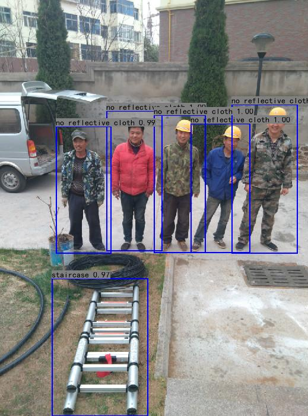
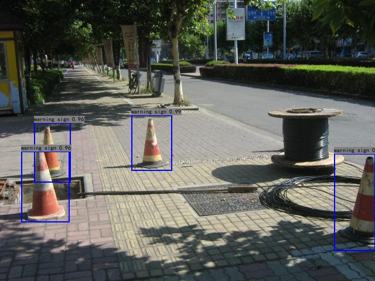
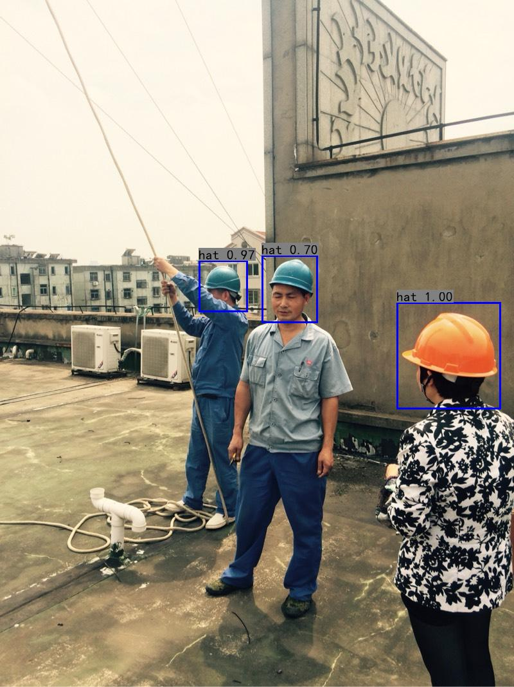
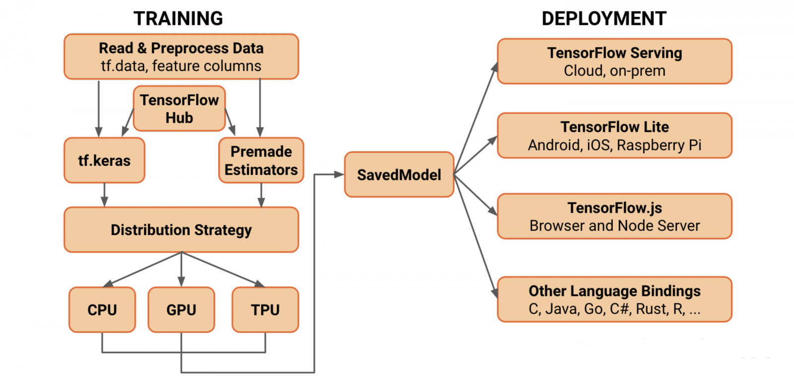

## Use Tensorflow2.X to Save Model and Predict

*save you model with saved-model format*

*deploy your model with saved-model format*

*Now, only support 416 resolution prediction because i hard code some constants in save_model.py.*

*I will decouple my codes in the future.*

___

**1. Save Model**

```shell
# save your model that contains postprocessing
# you can directly get boxes, scores and classes by inferrring
python save_model.py -h
```

```shell
usage: save_model.py [-h] [--num_anchors NUM_ANCHORS]
                     [--num_classes NUM_CLASSES] [--score SCORE] [--iou IOU]
                     [--img_path IMG_PATH] [--weight_path WEIGHT_PATH]
                     [--save_path SAVE_PATH]

save your model with saved-model format

optional arguments:
  -h, --help            show this help message and exit
  --num_anchors NUM_ANCHORS
                        number of your anchors
  --num_classes NUM_CLASSES
                        number of your classes
  --score SCORE         score threshold of prediction
  --iou IOU             iou threshold of prediction
  --img_path IMG_PATH   image that you want to predict
  --weight_path WEIGHT_PATH
                        the path of model weights
  --save_path SAVE_PATH
```

**2. Visualize Results**

```shell
# visualize your results and you can validate you saved_model
python visualize.py -h
```

```shell
visualize your results to validate your saved_model

optional arguments:
  -h, --help            show this help message and exit
  --classes_path CLASSES_PATH
  --model_path MODEL_PATH
  --img_path IMG_PATH
```

**3. Results**







**4. why i use saved_model format?**

Because saved_model format is a bridge in tensorflow ecology.

If you use **tensorflow serving** to do model persistence and deploy your projects,  saved_model format is a best choice.

If you use **tensorflow lite ** to do mobile projects, saved_model format is a best choice.



**5. Some Bugs**

**There are some bugs when use tf.squeeze and tf.reshape together in GPU environment. **

**But codes operated properly in CPU environment.**

**I didn't know the reason.**

```shell
# bugs about reshape_op
2020-09-09 23:39:54.446156: W tensorflow/core/framework/op_kernel.cc:1767] OP_REQUIRES failed at reshape_op.h:57 : Invalid argument: Size 1 must be non-negative, not -11
tensorflow.python.framework.errors_impl.InvalidArgumentError: 2 root error(s) found.
  (0) Invalid argument:  Size 1 must be non-negative, not -11
	 [[{{node StatefulPartitionedCall/functional_3/tf_op_layer_RealDiv_14/RealDiv_14-1-ReshapeNHWCToNCHW-LayoutOptimizer}}]]
	 [[StatefulPartitionedCall/functional_3/tf_op_layer_GatherV2_13/GatherV2_13/_26]]
  (1) Invalid argument:  Size 1 must be non-negative, not -11
	 [[{{node StatefulPartitionedCall/functional_3/tf_op_layer_RealDiv_14/RealDiv_14-1-ReshapeNHWCToNCHW-LayoutOptimizer}}]]
0 successful operations.
0 derived errors ignored. [Op:__inference_signature_wrapper_36980]
```

